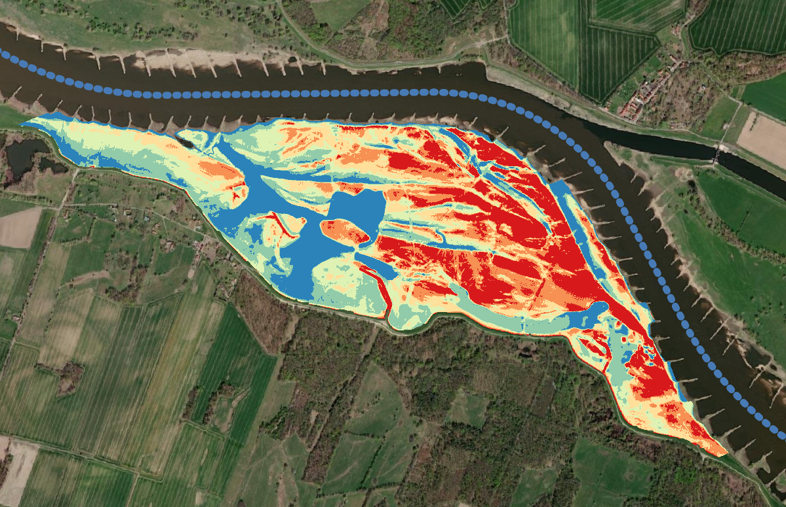

# QGIS-Plugin: Floodplain-Inundation-Calculator

## Aim
The frequency and duration of inundations in floodplains is of great interest as it affects habitat provision and biodiversity as well as various biogeochemical soil processes maintaining water quality. The development of the Inundation Calculator is intended to enable a simple approximation of yearly average flooding durations in floodplains by using river water levels and the floodplain topography. We are often confronted with the problem that no spatially and/or temporally high-resolution remote sensing data or open source 3D flooding model are available. So we need to find easy solutions which can be applied by everyone, although these remain rough approximations and users must be aware of application limitations.

## Approach
Floodplain inundation is reflected by overland inundation from the river channel to the floodplain when bank full conditions are exceeded. Additionally, due the rise and fall of the water table of the alluvial aquifer which is coherent with that of the river channel, flooding from below ground through the filling of the alluvial aquifer can inundate the floodplain. Based on this and due to lack of area-wide groundwater monitoring, raster cells with an elevation below the current river water level are assumed to be inundated in the modeling process. 
First, the Plugin makes use of a dictionary to create a histogram of all waterlevels (1cm resolution). Afterwards the frequency of inundation for each waterlevel is determined by accumulating histograms. Through counting from top to bottom, it is assumed that if height step x is inundated, all height steps below x are inundated too. This is then compared to the heights of the digital elevation model, so that for each height the sum of flooding days is stored in a matrix. Afterwards this matrix is divided by the number of considered years to get the gridded average inundation days per year. Finally, the information is transferred to the original xy-dimension of the digital elevation model.

## Report
For Use Instructions, please read the [REPORT](Report.pdf) included in this directory.

These instructions can also be watched in a video (english, with subtitles):
https://www.youtube.com/watch?v=OH0GrOaJ0NY
